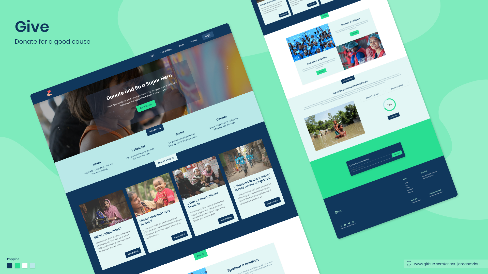
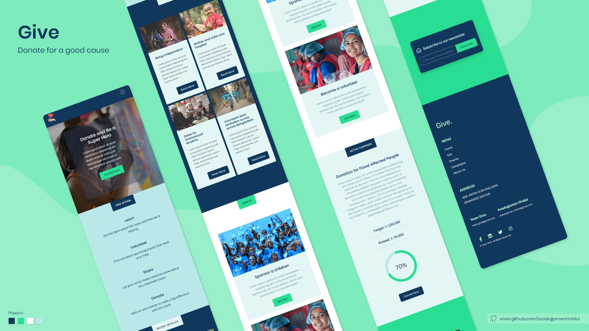
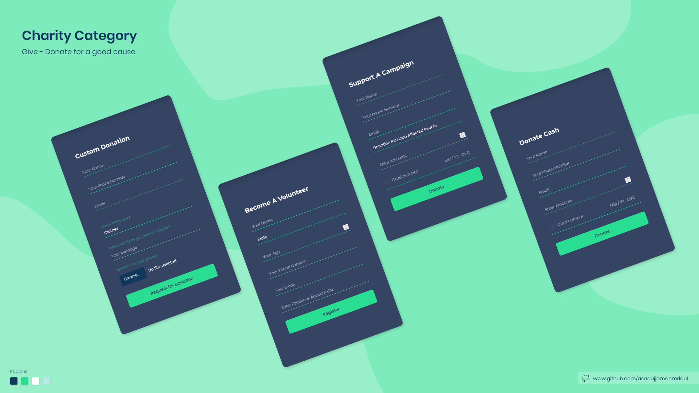
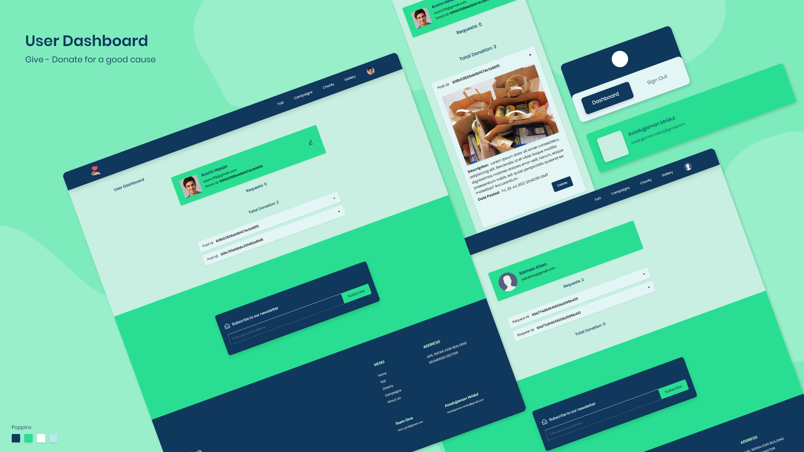
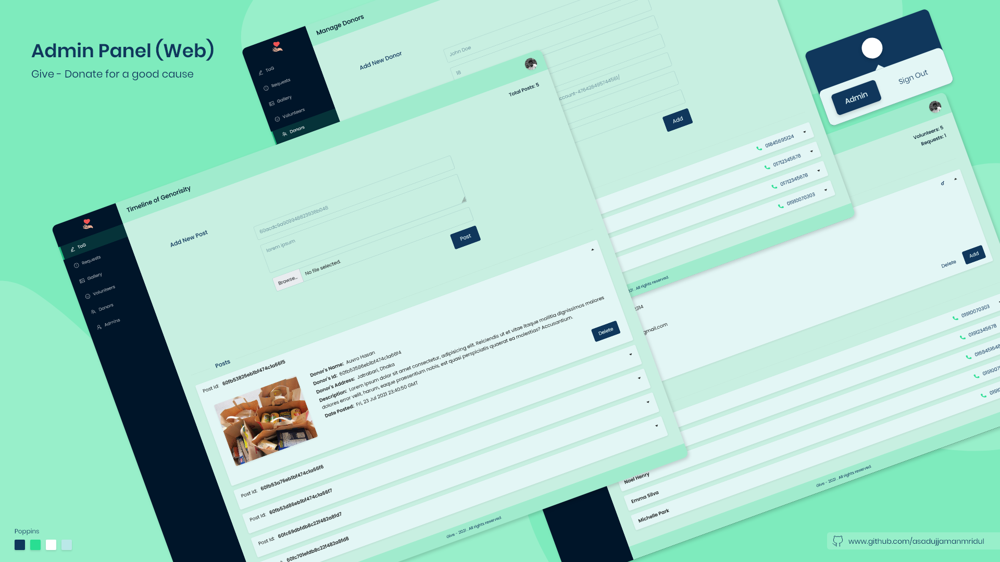
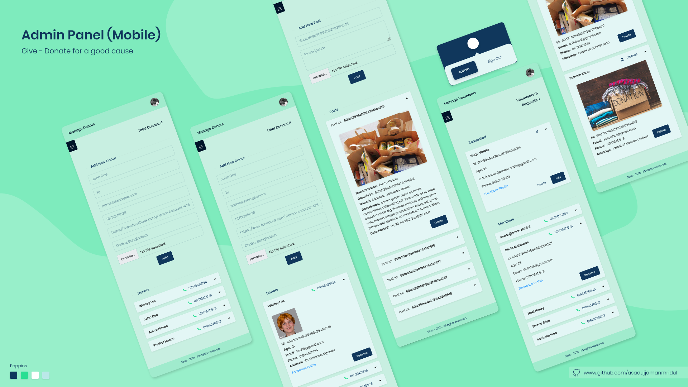

<h1 align="center">
   Give 
</h1>

#### Donate For a Good Cause

A non-profit organization for to spread humanity and kindness among the poor community of our country.

## Overview

Anyone can donate anything to the people in need, through this web application. There will be admins, moderators and volunteers for this project. If any user want to donate something, they have to register a request. The admins will review the request, and if the requested donation is acceptable, then they will contact with the donor personally. If the donor gives permission to share donation info publicly, the admins will put the info in the timeline. This will be visible to anyone logged-in the application. This timeline of generosity will motivate another person to step forward and donate something, for a good cause!

 
<h3 align="center">
  <a href="https://give-01.firebaseapp.com/">Live Site</a>
</h3>
 

### Technology Used
• MERN Stack  
• Stripe Payment Gateway  
 
• Firebase Auth  
• Firebase Hosting  
 
• React Router  
• React Hook Form  
• SCSS  
• Bootstrap  
• Ant Design

 

### Screenshots

 

  

<h5 align="center">
  Landing Page (web)
</h5>
 
 

  

<h5 align="center">
  Landing Page (mobile)
</h5>
 
 

  

<h5 align="center">
  Charity Sections
</h5>
 
 

  

<h5 align="center">
  User Dashboard
</h5>
 
 

  

<h5 align="center">
  Admin Panel (web)
</h5>
 
 

  

<h5 align="center">
  Admin Panel (mobile)
</h5>

 
 

## [Server Side Repo](https://github.com/AsadujjamanMridul/give-server/)

###### `Thank you`
